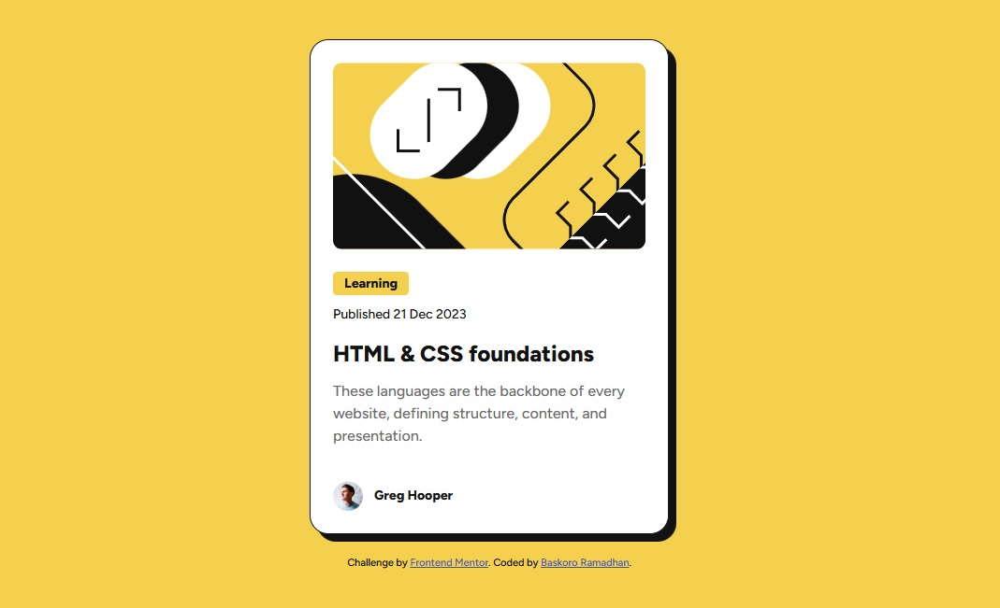

# Frontend Mentor - Blog preview card solution

This is a solution to the [Blog preview card challenge on Frontend Mentor](https://www.frontendmentor.io/challenges/blog-preview-card-ckPaj01IcS). Frontend Mentor challenges help you improve your coding skills by building realistic projects. 

## Table of contents

- [Overview](#overview)
  - [The challenge](#the-challenge)
  - [Screenshot](#screenshot)
  - [Links](#links)
- [My process](#my-process)
  - [Built with](#built-with)
  - [What I learned](#what-i-learned)
  - [Continued development](#continued-development)
- [Author](#author)

## Overview

### The challenge

Users should be able to:

- See hover and focus states for all interactive elements on the page (e.g., the article title).
- View the optimal layout depending on their device's screen size.

### Screenshot

 

### Links

- Solution URL: [Add your GitHub repo link here]
- Live Site URL: [Add your live site URL here, e.g., Vercel or GitHub Pages]

## My process

### Built with

- **Semantic HTML5 markup** - Using tags like `<article>`, `<time>`, and `<footer>` for better SEO and accessibility.
- **CSS custom properties** - Managing the color palette systematically using `:root` variables.
- **Flexbox** - Utilized for centering the card and managing internal spacing with the `gap` property.
- **Mobile-first workflow** - Ensuring the design is robust on small screens before scaling up to desktop.

### What I learned

During this project, I revisited the importance of fundamental CSS before jumping back into frameworks. I focused on deep-diving into the CSS Box Model.

A major takeaway was learning how to use a "solid" `box-shadow` (0px blur) to match the design's sharp aesthetic. I also practiced fixing element overlapping by using Flexbox `gap` instead of relying solely on individual margins.

### Continued development

In future projects, I plan to:

- Explore CSS Grid for more complex layout structures.

- Deepen my knowledge of Web Accessibility (A11y) to ensure my projects are usable for everyone.

- Implement BEM (Block Element Modifier) naming conventions to write more professional and scalable CSS.

## Author

Baskoro Ramadhan
